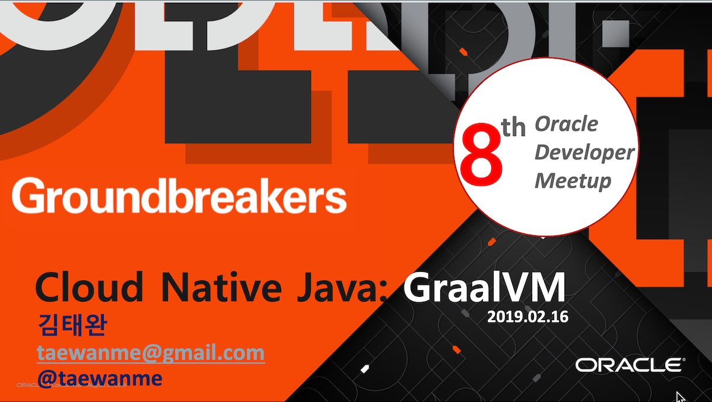
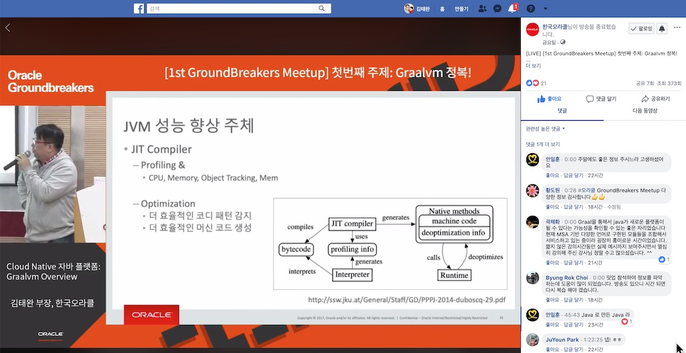

# GraalVM 세마나: 예제 코드

8번째 Oracle Developer Meetup에서 발표한 "Cloud Native Java:GraalVM"의 데모 코드입니다.

총 7개의 데모 코드를 공유합니다. Demo 코드 GraalVM의 공식 예제 및 데모 코드를 수정하여 사용했습니다.

- 데모 예시 코드는 다음과 같습니다.

- [./examples/e01](./examples/e01): graal과 tiered 컴파일러 비교
- [./examples/e01](./examples/e02): native image 만들기
- [./examples/e01](./examples/e03): LLVM 인터프리터를 이용한 C코드 실행과 호출
- [./examples/e01](./examples/e04): Polyglot 데모
- [./examples/e01](./examples/e05): micronaut의 graamvm native image 지원
- [./examples/e01](./examples/e06): Spring & R 연동
- [./examples/e01](./examples/e07): JavaScript, Java, R 연동

## 세미나 동영상

세미나 동영상은 다음 URL에서 보실 수 있습니다.

<iframe src="https://www.facebook.com/plugins/video.php?href=https%3A%2F%2Fwww.facebook.com%2FOracleKorea%2Fvideos%2F899585790388647%2F&show_text=0&width=560" width="560" height="315" style="border:none;overflow:hidden" scrolling="no" frameborder="0" allowTransparency="true" allowFullScreen="true"></iframe>

