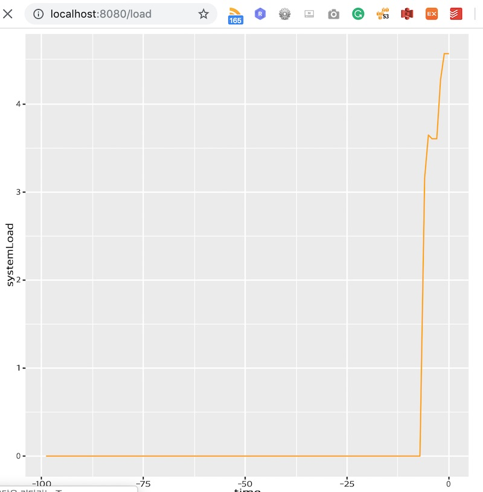

# Java, R, javascript 연동

GraalVM을 이용한 Spring과 R 연동 데모입니다.

- 코드 출처
    - https://github.com/graalvm/graalvm-demos/tree/master/spring-r

## 설치 환경
    - sdkman(https://sdkman.io/)

## 데모 환경
    - GraalVM - 1.0.0-rc-12-grl
    - Maven
    - FastR


## 데모 환경 구성

```
~/graaldemo/example/e06  sdk install java 1.0.0-rc-12-grl
~/graaldemo/example/e06  sdk use java 1.0.0-rc-12-grl
~/graaldemo/example/e06  sdk install maven
~/graaldemo/example/e06  gu install R
```

## 실습

```
~/graaldemo/example/e06/spring-r  mvn spring-boot:run
[INFO] Scanning for projects...
[INFO]
[INFO] ----------------< org.graalvm.demos.spring-r:spring-r >-----------------
[INFO] Building spring-r 0.0.1-SNAPSHOT
[INFO] --------------------------------[ jar ]---------------------------------
[INFO]
[INFO] >>> spring-boot-maven-plugin:2.0.1.RELEASE:run (default-cli) > test-compile @ spring-r >>>
[INFO]
[INFO] --- maven-resources-plugin:3.0.1:resources (default-resources) @ spring-r ---
[INFO] Using 'UTF-8' encoding to copy filtered resources.
[INFO] Copying 1 resource
[INFO] Copying 1 resource
[INFO]
[INFO] --- maven-compiler-plugin:3.7.0:compile (default-compile) @ spring-r ---
[INFO] Nothing to compile - all classes are up to date
[INFO]
[INFO] --- maven-resources-plugin:3.0.1:testResources (default-testResources) @ spring-r ---
[INFO] Using 'UTF-8' encoding to copy filtered resources.
[INFO] skip non existing resourceDirectory /Users/taewan/graaldemo/example/e06/spring-r/src/test/resources
[INFO]
[INFO] --- maven-compiler-plugin:3.7.0:testCompile (default-testCompile) @ spring-r ---
[INFO] Nothing to compile - all classes are up to date
[INFO]
[INFO] <<< spring-boot-maven-plugin:2.0.1.RELEASE:run (default-cli) < test-compile @ spring-r <<<
[INFO]
[INFO]
[INFO] --- spring-boot-maven-plugin:2.0.1.RELEASE:run (default-cli) @ spring-r ---

 .   ____          _            __ _ _
/\\ / ___'_ __ _ _(_)_ __  __ _ \ \ \ \
( ( )\___ | '_ | '_| | '_ \/ _` | \ \ \ \
\\/  ___)| |_)| | | | | || (_| |  ) ) ) )
 '  |____| .__|_| |_|_| |_\__, | / / / /
=========|_|==============|___/=/_/_/_/
:: Spring Boot ::        (v2.0.1.RELEASE)

2019-02-17 14:00:38.092  INFO 66529 --- [           main] o.g.demos.springr.SpringRApplication     : Starting SpringRApplication on taewanui-MacBook-Pro.local with PID 66529 (/Users/taewan/graaldemo/example/e06/spring-r/target/classes started by taewan in /Users/taewan/graaldemo/example/e06/spring-r)
2019-02-17 14:00:38.094  INFO 66529 --- [           main] o.g.demos.springr.SpringRApplication     : No active profile set, falling back to default profiles: default
2019-02-17 14:00:38.140  INFO 66529 --- [           main] ConfigServletWebServerApplicationContext : Refreshing org.springframework.boot.web.servlet.context.AnnotationConfigServletWebServerApplicationContext@6f048062: startup date [Sun Feb 17 14:00:38 KST 2019]; root of context hierarchy
2019-02-17 14:00:38.949  INFO 66529 --- [           main] o.s.b.w.embedded.tomcat.TomcatWebServer  : Tomcat initialized with port(s): 8080 (http)
2019-02-17 14:00:39.215  INFO 66529 --- [           main] o.apache.catalina.core.StandardService   : Starting service [Tomcat]
2019-02-17 14:00:39.215  INFO 66529 --- [           main] org.apache.catalina.core.StandardEngine  : Starting Servlet Engine: Apache Tomcat/8.5.29
2019-02-17 14:00:39.224  INFO 66529 --- [ost-startStop-1] o.a.catalina.core.AprLifecycleListener   : The APR based Apache Tomcat Native library which allows optimal performance in production environments was not found on the java.library.path: [/Users/taewan/Library/Java/Extensions:/Library/Java/Extensions:/Network/Library/Java/Extensions:/System/Library/Java/Extensions:/usr/lib/java:.]
2019-02-17 14:00:39.288  INFO 66529 --- [ost-startStop-1] o.a.c.c.C.[Tomcat].[localhost].[/]       : Initializing Spring embedded WebApplicationContext
2019-02-17 14:00:39.288  INFO 66529 --- [ost-startStop-1] o.s.web.context.ContextLoader            : Root WebApplicationContext: initialization completed in 1151 ms
2019-02-17 14:00:39.386  INFO 66529 --- [ost-startStop-1] o.s.b.w.servlet.ServletRegistrationBean  : Servlet dispatcherServlet mapped to [/]
2019-02-17 14:00:39.389  INFO 66529 --- [ost-startStop-1] o.s.b.w.servlet.FilterRegistrationBean   : Mapping filter: 'characterEncodingFilter' to: [/*]
2019-02-17 14:00:39.390  INFO 66529 --- [ost-startStop-1] o.s.b.w.servlet.FilterRegistrationBean   : Mapping filter: 'hiddenHttpMethodFilter' to: [/*]
2019-02-17 14:00:39.390  INFO 66529 --- [ost-startStop-1] o.s.b.w.servlet.FilterRegistrationBean   : Mapping filter: 'httpPutFormContentFilter' to: [/*]
2019-02-17 14:00:39.390  INFO 66529 --- [ost-startStop-1] o.s.b.w.servlet.FilterRegistrationBean   : Mapping filter: 'requestContextFilter' to: [/*]
2019-02-17 14:00:49.211  INFO 66529 --- [           main] o.s.w.s.handler.SimpleUrlHandlerMapping  : Mapped URL path [/**/favicon.ico] onto handler of type [class org.springframework.web.servlet.resource.ResourceHttpRequestHandler]
2019-02-17 14:00:49.507  INFO 66529 --- [           main] s.w.s.m.m.a.RequestMappingHandlerAdapter : Looking for @ControllerAdvice: org.springframework.boot.web.servlet.context.AnnotationConfigServletWebServerApplicationContext@6f048062: startup date [Sun Feb 17 14:00:38 KST 2019]; root of context hierarchy
2019-02-17 14:00:49.609  INFO 66529 --- [           main] s.w.s.m.m.a.RequestMappingHandlerMapping : Mapped "{[/load],produces=[image/svg+xml]}" onto public org.springframework.http.ResponseEntity<java.lang.String> org.graalvm.demos.springr.SpringRApplication.load()
2019-02-17 14:00:49.614  INFO 66529 --- [           main] s.w.s.m.m.a.RequestMappingHandlerMapping : Mapped "{[/error]}" onto public org.springframework.http.ResponseEntity<java.util.Map<java.lang.String, java.lang.Object>> org.springframework.boot.autoconfigure.web.servlet.error.BasicErrorController.error(javax.servlet.http.HttpServletRequest)
2019-02-17 14:00:49.615  INFO 66529 --- [           main] s.w.s.m.m.a.RequestMappingHandlerMapping : Mapped "{[/error],produces=[text/html]}" onto public org.springframework.web.servlet.ModelAndView org.springframework.boot.autoconfigure.web.servlet.error.BasicErrorController.errorHtml(javax.servlet.http.HttpServletRequest,javax.servlet.http.HttpServletResponse)
2019-02-17 14:00:49.646  INFO 66529 --- [           main] o.s.w.s.handler.SimpleUrlHandlerMapping  : Mapped URL path [/webjars/**] onto handler of type [class org.springframework.web.servlet.resource.ResourceHttpRequestHandler]
2019-02-17 14:00:49.647  INFO 66529 --- [           main] o.s.w.s.handler.SimpleUrlHandlerMapping  : Mapped URL path [/**] onto handler of type [class org.springframework.web.servlet.resource.ResourceHttpRequestHandler]
2019-02-17 14:00:49.822  INFO 66529 --- [           main] o.s.j.e.a.AnnotationMBeanExporter        : Registering beans for JMX exposure on startup
2019-02-17 14:00:49.887  INFO 66529 --- [           main] o.s.b.w.embedded.tomcat.TomcatWebServer  : Tomcat started on port(s): 8080 (http) with context path ''
2019-02-17 14:00:49.893  INFO 66529 --- [           main] o.g.demos.springr.SpringRApplication     : Started SpringRApplication in 27.108 seconds (JVM running for 30.933)

```

- UI 조회
    - http://localhost:8080/load


