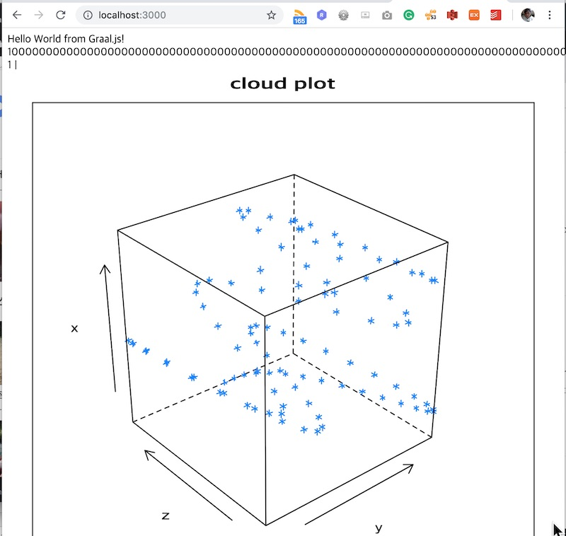

# Express Web Application: R & Java 연동

JavaScript, R, Java 연동 데모입니다.

- 코드 출처
    - https://github.com/graalvm/graalvm-demos/tree/master/polyglot-javascript-java-r

## 설치 환경
    - sdkman(https://sdkman.io/)

## 데모 환경
    - GraalVM - 1.0.0-rc-12-grl

## 데모 환경 구성

```
~/graaldemo/examples/e06  sdk install java 1.0.0-rc-12-grl
~/graaldemo/examples/e06  sdk use java 1.0.0-rc-12-grl
~/graaldemo/examples/e06  gu install javascript
~/graaldemo/examples/e06  gu install R
~/graaldemo/examples/e06  Rscript -e "install.packages(\"ggplot2\")"
```

## 실습

```
~/graaldemo/examples/e07/polyglot-javascript-java-r  ./build.sh
+ npm install
npm WARN polyglot-javascript-java-r No description
npm WARN polyglot-javascript-java-r No repository field.
npm WARN polyglot-javascript-java-r No license field.

added 50 packages from 47 contributors and audited 119 packages in 22.858s
found 0 vulnerabilities


  ╭───────────────────────────────────────────────────────────────╮
  │                                                               │
  │       New minor version of npm available! 6.4.1 → 6.8.0       │
  │   Changelog: https://github.com/npm/cli/releases/tag/v6.8.0   │
  │               Run npm install -g npm to update!               │
  │                                                               │
  ╰───────────────────────────────────────────────────────────────╯

~/graaldemo/examples/e07/polyglot-javascript-java-r  ./run.js
Example app listening on port 3000!
Loading required package: lattice
```

- 결과 조회
    - http://localhost:3000


